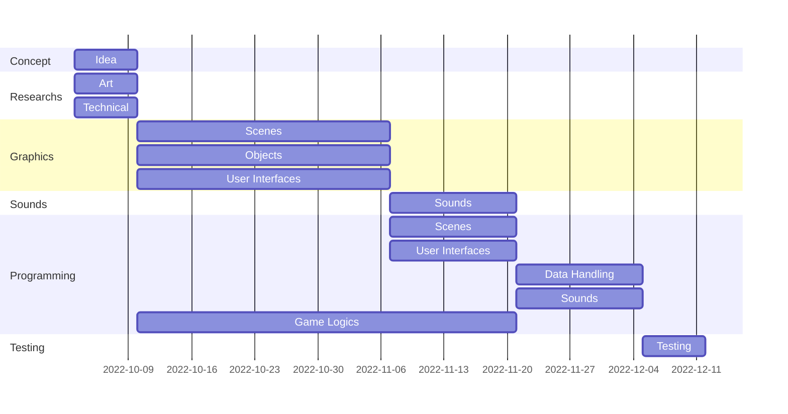
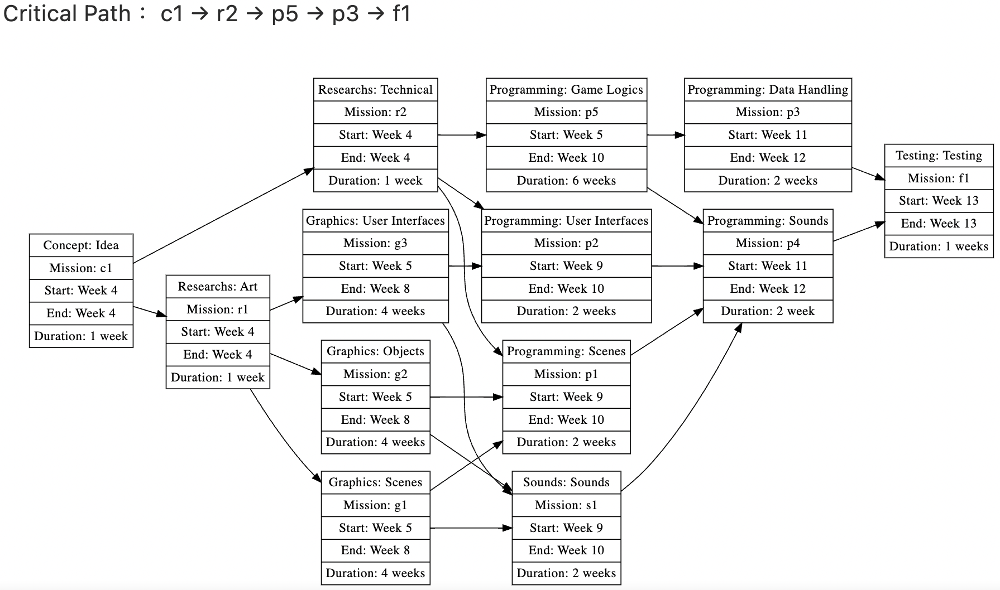

# 系統分析與設計 小組專題 作業1
##  組別
第14組
## 組員名單
- 蔡明智（組長）
- 姚家浩
- 袁顥洋
- 禤蔚灝
- 俞閎譯

## 題目
Unity機車駕駛小遊戲 - 每日路上

## 介紹
以Unity製作的單人休閒遊戲。玩家須在一條大直路上操控自己的機車向前走，並避開路上所有的障礙物以避免交通事故發生；另外加入安全駕駛知識，讓玩家了解如何安全地駕駛。

## 甘特圖

## PERT圖

## 分工表

|任務＼組員|蔡明智|姚家浩|袁顥洋|禤蔚灝|俞閎譯|
|--------|:---:|:---:|:---:|:---:|:---:|
|Concept: Idea|✔|✔|✔|✔|✔|
|Researchs: Art||✔|✔|✔|✔|
|Researchs: Technical|✔|✔|✔|✔|✔|
|Graphics: Scenes|✔|||||
|Graphics: Objects|✔|||||
|Graphics: User Interfaces||✔|✔|||
|Sounds: Sounds||✔|✔|✔|✔|
|Programming: Scenes|✔|✔|✔|✔|✔|
|Programming: User Interfaces|✔|✔|✔|✔|✔|
|Programming: Data Handling|✔|||✔||
|Programming: Sounds|✔|✔|✔|✔|✔|
|Programming: Game Logics|✔||||✔|
|Testing: Testing|✔|✔|✔|✔|✔|
