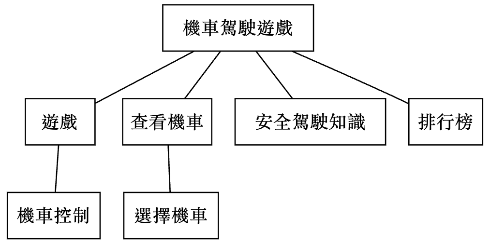
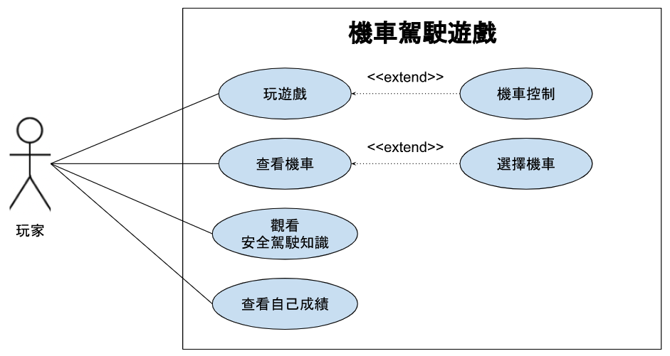

# 系統分析與設計 小組專題 作業2

# 功能性需求
- 玩遊戲
- 選擇機車
- 觀看安全駕駛知識

## 非功能性需求
- 遊戲暢順運行
- 介面、控制簡單直接、容易上手
- 正確的安全駕駛知識

## 功能分解圖

## 需求分析
- 玩家可進入「遊戲」以遊玩遊戲
- 玩家可進入「選擇機車」以選擇遊戲中所使用的機車
- 玩家可進入「安全駕駛知識」以了解如何安全地駕駛

## 使用案例圖

## 使用案例說明

## 使用案例動態模擬畫面
https://www.figma.com/file/ORZNVnes7LU2IVJr8QSTn9/Motorcycle
