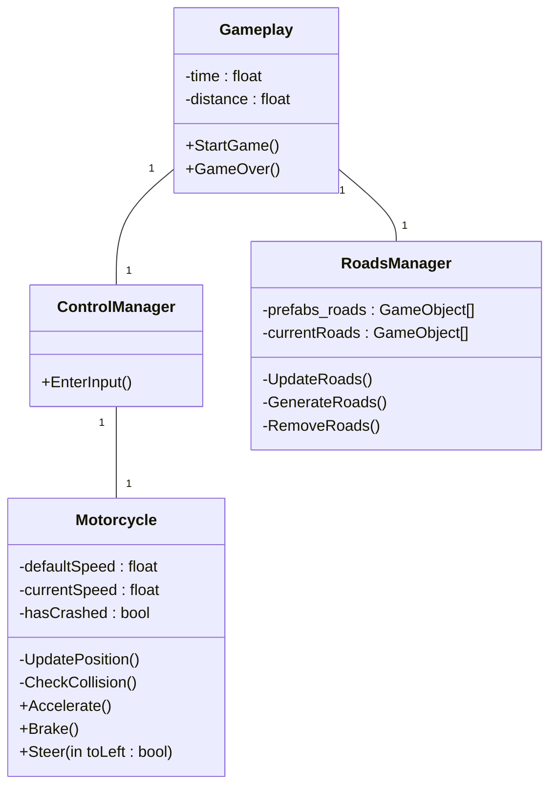

# 系統分析與設計 小組專題 作業

## UML 類別圖

```mermaid
classDiagram
    Gameplay "1"--"1" ControlManager
    ControlManager "1"--"1" Motorcycle
    Gameplay "1"--"1" RoadsManager
    
    class Gameplay{
        -time : float
        -distance : float
        +StartGame()
        +GameOver()
    }
    
    class Motorcycle{
        -defaultSpeed : float
        -currentSpeed : float
        -hasCrashed : bool
        -UpdatePosition()
        -CheckCollision()
        +Accelerate()
        +Brake()
        +Steer(in toLeft : bool)
    }
    
    class ControlManager{
        +EnterInput()
    }
    
    class RoadsManager{
        -prefabs_roads : GameObject[]
        -currentRoads : GameObject[]
        -UpdateRoads()
        -GenerateRoads()
        -RemoveRoads()
    }
```

## 循序圖與活動圖
